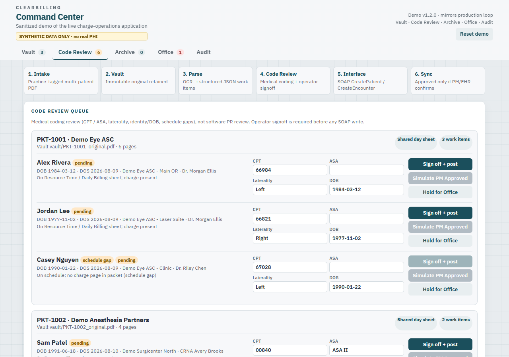
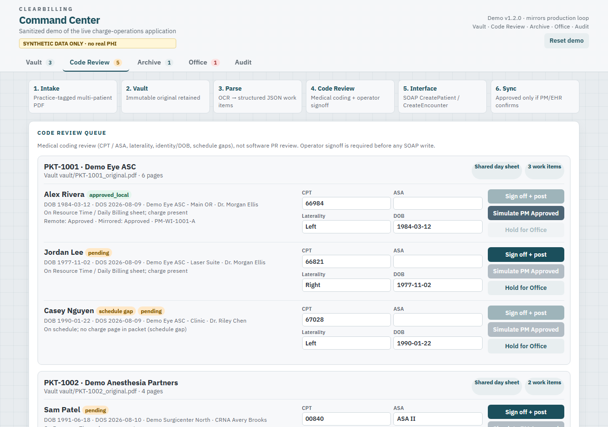
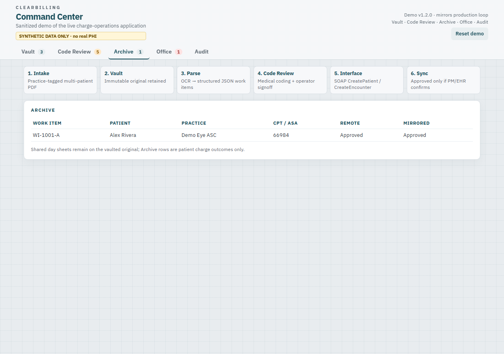
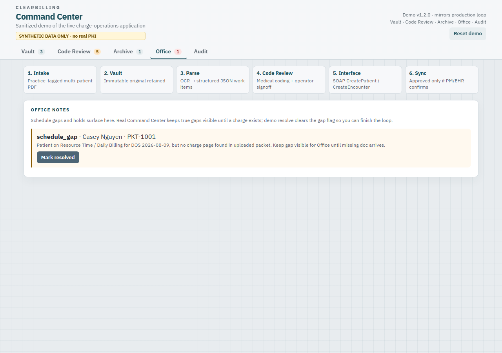

# Command Center Demo - Operator & Analyst Guide

**Audience:** hiring managers, trainers, and anyone evaluating documentation quality  
**System:** ClearBilling Command Center (public workflow sandbox)  
**Data:** synthetic only - no real PHI  
**Run locally:** `python app.py` then open http://127.0.0.1:5055

> **Not the production UI.** Live Command Center chrome, PDF OCR, vault image cache, vendor integrations, and operator tooling stay private for proprietary protection. Screenshots in this guide are of **this sandbox**. The review → interface → fail-safe sync **loop** is what matches production.

This guide is written the same way production operator docs are written: short purpose, screen-by-screen steps, expected results, and failure handling.

---

## 1. Purpose

Command Center turns multi-patient anesthesia / clinical charge packets into reviewed, interface-posted encounters:

1. Vault the original packet  
2. Parse into patient work items  
3. Human **medical coding** review (CPT/ASA, laterality, DOB, schedule gaps)  
4. Operator signoff  
5. SOAP `CreatePatient` + `CreateEncounter` to the PM/EHR (mock in this demo)  
6. Mirror Draft / Approved **only** after interface confirmation  

Live production uses real PDFs and a real PM/EHR. This demo uses synthetic JSON packets, a simplified teaching UI, and an in-process mock interface so the loop is safe to share publicly without exposing proprietary product chrome.

---

## 2. Screen map

| Tab | What operators use it for |
|---|---|
| **Vault** | Confirm what was uploaded, page counts, shared day sheets, practice tags |
| **Code Review** | Edit coding fields, sign off, or hold for Office |
| **Archive** | Patient outcomes after signoff + interface post |
| **Office** | Schedule gaps, holds, missing-doc follow-ups |
| **Audit** | Interface call log, events, incidents, demo changelog |

---

## 3. Walkthrough (happy path)

### Step A - Vault overview

Open **Vault**. Confirm packets, practices, pending review count, and schedule-gap count.

**Expected:** synthetic packets for Demo Eye ASC, Demo Anesthesia Partners, and Demo Fertility Center. Shared Resource Time / Daily Billing sheets stay on the batch (they are not charge patients).

### Step B - Medical coding review

Open **Code Review**. For a patient **without** a schedule-gap chip:

1. Verify DOB, DOS, laterality, CPT, ASA (if anesthesia)  
2. Adjust fields if needed  
3. Click **Sign off + post**

**Expected:** middleware logs `SOAP:CreatePatient` then `SOAP:CreateEncounter` with remote status **Draft**. Local mirrored status stays Draft until the PM confirms Approved.

### Step C - Fail-safe status sync

Still on that work item, click **Simulate PM Approved**.

**Expected:** remote and mirrored status both become **Approved**. The demo never forces Approved while remote is still Draft (same rule as production).

### Step D - Archive

Open **Archive**.

**Expected:** one row per signed-off patient with CPT/ASA, remote status, and mirrored status. Shared day sheets remain on the vaulted original, not as Archive charge rows.

---

## 4. Walkthrough (schedule gap / Office)

### Why gaps matter

If a patient is on the Resource Time / Daily Billing sheet but the packet has no charge page, that is a **real schedule gap**. Production keeps the gap visible for Office. The demo blocks **Sign off + post** until the Office note is resolved.

### Steps

1. Open **Office**  
2. Read the open schedule-gap note (Casey Nguyen on PKT-1001)  
3. Click **Mark resolved** (demo stand-in for “missing charge attached”)  
4. Return to **Code Review** and sign off that patient  

**Hold path:** on any pending work item, **Hold for Office** creates an Office note without posting to the interface.

---

## 5. Audit / support trail

Open **Audit** after a few actions.

**Use this tab to show:**

- Interface methods and results (`CreatePatient`, `CreateEncounter`, `SetEncounterStatus`)  
- Operator events (approve, hold, sync, office resolve)  
- Validation incidents if a required field is missing  

Also available as JSON for tooling checks:

- `/api/health` - counts and synthetic PHI mode  
- `/api/state` - full demo state dump  

---

## 6. Reset

Click **Reset demo** in the masthead (or `POST /api/reset`) to reload seed packets and clear the mock PM/EHR.

---

## 7. How this maps to analyst documentation skills

| Doc habit | Shown here |
|---|---|
| Audience + purpose up front | Sections 1-2 |
| Screen-referenced procedures | Sections 3-5 with screenshots |
| Expected results after each action | Callouts under each step |
| Exception path documented | Schedule gap / hold in Section 4 |
| Support / audit evidence | Section 5 |
| Safe public boundary | Synthetic-only banner and honest “not production” note |

For Bryan Ancillary IT conversations: this is the same documentation pattern used for live Command Center operator training - shortened and sanitized for GitHub.

---

## 8. Related files

- [README.md](../README.md) - quick start  
- [ARCHITECTURE.md](ARCHITECTURE.md) - component map  
- [HIPAA_CONTROLS.md](HIPAA_CONTROLS.md) - control summary  
- `tools/capture_screenshots.py` - regenerate PNGs after UI changes  
